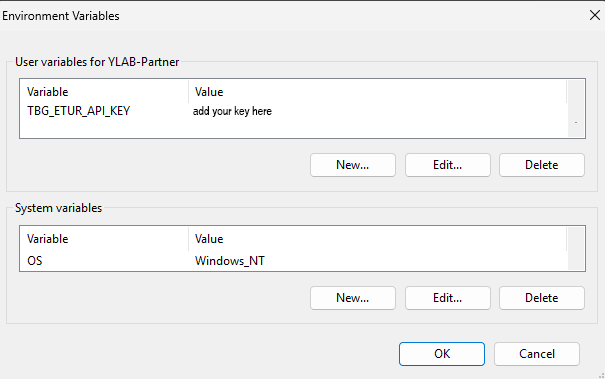

# ComfyUI-TBG-ETUR: Enhance Your Images with TBG's Upscaler and Refiner
**TBG_Enhanced Tiled Upscaler & Refiner PRO**

## Table of Contents
- [Overview](#overview)
- [Early_Access](#Early_Access)
- [Features](#features)
- [Installation](#installation)
- [API_Access](#API_Access)
- [Usage](#usage)

## Overview

Welcome to **ComfyUI-TBG-ETUR** repository! **TBG Enhanced Tiled Upscaler and Refiner Pro!**
We at **TBG Think. Build. Generate. AI upscaling & image enrichment** are
excited to make our TBG Enhanced Tiled Upscaler and Refiner Pro available to you.

# Alpha Testing of PRO Features Now Available

We’re excited to announce that alpha testing of the PRO version is now live
for our Patreon supporters and free community members!

Please help us to find all Bugs and open an issue here !!!

You can download the latest version of our software [here]([https://github.com/Pk07-cpu/ComfyUI-TBG-ETUR/releases](https://github.com/Ltamann/ComfyUI-TBG-ETUR/releases). 

## Early_Access
Get early access by joining us at:
https://www.patreon.com/TB_LAAR

The CE (Community Edition) nodes are free and standalone, suitable for any type of workflow. For access to some PRO features, a TB_LAAR Patreon membership is required. The free version is sufficient for testing and experimenting. Once you become a member, you can obtain your API key:
https://api.ylab.es/login.php 

## Features

**TBG Enhanced Tiled Upscaler and Refiner Pro** is an advanced, modular enhancement suite for **tiled image generation and refinement** in ComfyUI. It introduces neuro generative tile fusion, interactive tile-based editing, and multi-path processing pipelines designed for extreme resolution workflows up to but not limitet to 100MP, high fidelity, and adaptive post-generation control.

- **AI Image Enhancemen**t: Applies advanced algorithms to improve visual quality.
- **High-Resolution Generation**: Creates images with greater clarity and fine detail.
- **Image Polishing**: Enhances visuals for a smooth, finished appearance.
- **Neuro-Generative Tile Fusion**: Seamlessly fuses image tiles into a coherent whole.
- **User-Friendly Interface**: CE version built for straightforward and intuitive use, Pro version offers advanced customization.

## 1. New Fusion Techniques

TBG Enhanced Tiled Upscaler and Refiner Pro introduces tree next-generation tile fusion processes that go far beyond traditional blending:

### Smart Merge CE
Choose between adaptive blending strategies compatible with common upscalers like USDU,and others. It intelligently handles tile overlaps, avoiding ghosting and seams.

### PRO Tile Diffusion  
A novel approach where each tile is generated while considering surrounding tile information — perfect for mid-denoise levels. This enables:
- Context-aware detail consistency  
- Smooth transitions across tile borders  
- Better handling of textures and patterns  

### PRO Neuro-Generative Tile Fusion (NGTF)  
An advanced generative system that remembers newly generated surroundings and adapts subsequent sampling steps accordingly. This makes high-denoise tile refinement possible while maintaining:
- Global consistency  
- Sharp, coherent details  
- Memory of contextual relationships across tiles  

## 2. Design Suite

TBG_Enhanced is not only about quality — it's about flexible, editable workflows over time:

### One-Tile Preview & Smart Presets  
Quickly generate single-tile previews to fine-tune the right settings before running the full job. Presets adapt intelligently to image dimensions and desired resolution.

### Post-Sampling Tile Correction  
You can resample only the tiles you don’t like — no need to regenerate the full image. This allows:
- Precision editing  
- Fixing small errors without full reprocessing  

### Resume Tile Refinement  
Modify or refine individual tiles days later while keeping the original input image and final result. The system supports:
- Saved tile maps and settings  
- Re-injection of noise and conditioning  
- Fully restorable editing workflows  

## 3. Pipeline Structure

TBG_Enhanced is powered by a flexible pipeline architecture built around tile-aware processing paths:

### TBG Tile Prompter Pipe  
Access prompt and denoise settings per tile. Enables:
- Per-region storytelling  
- Adaptive text-to-image behavior  
- Denoising strength by tile  

### TBG Tile Enrichment Pipe  
Control multiple sampling and model-level features:
- Model-side: Use DemonTools for deep model manipulation  
- Sampler-side: Inject custom noise at specific steps, or apply sigma curves to selected steps  
- Sampler-internal: Enable per-step sampler-side noise injection  
- Built-in noise reduction  
- Optional tile up/downscaling during sampling  

### ControlNet Pipe  
Tiled generation now supports unlimited ControlNet inputs per tile, unlocking:
- High-resolution conditioning  
- Fine-grained control for large images  
- Targeted structure, depth, edge, pose, or segmentation maps for each region  

## Status and Roadmap

- Fusion Techniques: Smart Merge, Tile Diffusion, NGTF  
- Post-editing Tools: One-tile preview, correction, resume-refine  
- Pipelines: Prompt / Enrichment / ControlNet Pipes  
- Upcoming: Full integration with custom samplers and DreamEdit compatibility  

## Installation
To install the TBG Enhanced Tiled Upscaler and Refiner Pro, follow these steps:

**Install this git from the Manager**:
   [https://github.com/Ltamann/ComfyUI-TBG-ETUR](https://github.com/Ltamann/ComfyUI-TBG-ETUR)
   
o Download the Software and Copy the folder 'ComfyUI-TBG-ETUR' into your ComfyUI custom_nodes directory:
    ..\ComfyUI\custom_nodes\
   and then run from  ..\ComfyUI\custom_nodes\ComfyUI-TBG-ETUR\
   pip install -r requirements.txt

## API_Access
   If you like to test theh PRO feachers get early access by joining us at:
   https://www.patreon.com/TB_LAAR

   You must be a TB_LAAR Patreon supporter or free member to get an API key which you can get here:
   https://api.ylab.es/login.php
   
   You can paste it directly into the TBG Tiler node, but keep in mind that doing so will embed it into your images and workflow metadata, making it easy to share unintentionally.
   For better security, consider adding the key to your environment variables using TBG_ETUR_API_KEY instead.

   
   
--------------------------------------------------------------
## Usage
check https://youtu.be/fyQRj5nv1IE

Recommended Workflow:
Do your setup and testing with PRO features turned OFF,
and only enable them for the final steps of your workflow.

Thank you for your support and happy tiling!

## Topics
- ai-image-processing
- ai-upscaler
- comfyui
- comfyui-node
- comfyui-nodes
- high-resolution
- image-refinement
- image-upscaling
- neuro-generative-tile-fusion
- stable-diffusion
- tbg-enhanced-tiled-upscaler-and-refiner-pro
- tiled-upscaling
