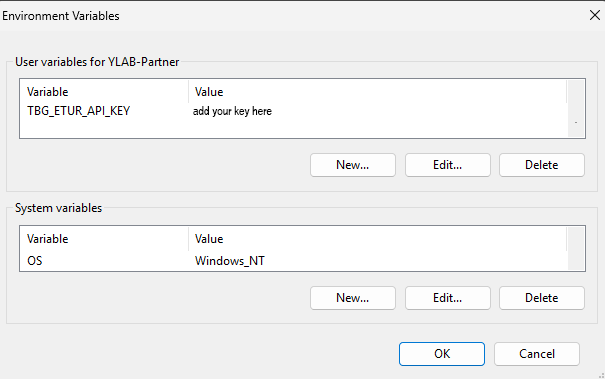

# ComfyUI-TBG-ETUR: Enhance Your Images with TBG's Upscaler
**TBG_Enhanced Tiled Upscaler & Refiner FLUX PRO**

## Table of Contents
- [Overview](#overview)
- [Early_Access](#Early_Access)
- [Features](#features)
- [Installation](#installation)
- [API_Access](#API_Access)
- [Usage](#usage)
- [Update 1.04 alfa](#Update)

## Overview

Welcome to **ComfyUI-TBG-ETUR** repository! **TBG Enhanced Tiled Upscaler and Refiner Pro!**
We at **TBG Think. Build. Generate. AI upscaling & image enrichment** are
excited to make our TBG Enhanced Tiled Upscaler and Refiner Pro available to you.

# Alpha Testing of PRO Features Now Available

We’re excited to announce that alpha testing of the PRO version is now live
for our Patreon supporters and free community members!

Please help us to find all Bugs and open an issue here !!!

You can download the latest version of our software [here]([https://github.com/Ltamann/ComfyUI-TBG-ETUR](https://github.com/Ltamann/ComfyUI-TBG-ETUR). 
!!! Note: This code is updated daily, so stay tuned for bug fixes !!!

## Early_Access
Get early access by joining us at:
https://www.patreon.com/TB_LAAR

The CE (Community Edition) nodes are free and standalone, suitable for any type of workflow. For access to some PRO features, a TB_LAAR Patreon membership is required. The free version is sufficient for testing and experimenting. Once you become a member, you can obtain your API key:
https://api.ylab.es/login.php 

## Features

**TBG Enhanced Tiled Upscaler and Refiner Pro** is an advanced, modular enhancement suite for **tiled image generation and refinement** in ComfyUI. It introduces neuro generative tile fusion, interactive tile-based editing, and multi-path processing pipelines designed for extreme resolution workflows up to but not limitet to 100MP, high fidelity, and adaptive post-generation control.

- **AI Image Enhancemen**t: Applies advanced algorithms to improve visual quality.
- **High-Resolution Generation**: Creates images with greater clarity and fine detail.
- **Image Polishing**: Enhances visuals for a smooth, finished appearance.
- **Neuro-Generative Tile Fusion**: Seamlessly fuses image tiles into a coherent whole.
- **User-Friendly Interface**: CE version built for straightforward and intuitive use, Pro version offers advanced customization.

## 1. New Fusion Techniques

TBG Enhanced Tiled Upscaler and Refiner Pro introduces tree next-generation tile fusion processes that go far beyond traditional blending:

### Smart Merge CE
Choose between adaptive blending strategies compatible with common upscalers like USDU,and others. It intelligently handles tile overlaps, avoiding ghosting and seams.

### PRO Tile Diffusion  
A novel approach where each tile is generated while considering surrounding tile information — perfect for mid-denoise levels. This enables:
- Context-aware detail consistency  
- Smooth transitions across tile borders  
- Better handling of textures and patterns  

### PRO Neuro-Generative Tile Fusion (NGTF)  
An advanced generative system that remembers newly generated surroundings and adapts subsequent sampling steps accordingly. This makes high-denoise tile refinement possible while maintaining:
- Global consistency  
- Sharp, coherent details  
- Memory of contextual relationships across tiles  

## 2. Design Suite

TBG_Enhanced is not only about quality — it's about flexible, editable workflows over time:

### One-Tile Preview & Smart Presets  
Quickly generate single-tile previews to fine-tune the right settings before running the full job. Presets adapt intelligently to image dimensions and desired resolution.

### Post-Sampling Tile Correction  
You can resample only the tiles you don’t like — no need to regenerate the full image. This allows:
- Precision editing  
- Fixing small errors without full reprocessing  

### Resume Tile Refinement  
Modify or refine individual tiles days later while keeping the original input image and final result. The system supports:
- Saved tile maps and settings  
- Re-injection of noise and conditioning  
- Fully restorable editing workflows  

## 3. Pipeline Structure

TBG_Enhanced is powered by a flexible pipeline architecture built around tile-aware processing paths:

### TBG Tile Prompter Pipe  
Access prompt and denoise settings per tile. Enables:
- Per-region storytelling  
- Adaptive text-to-image behavior  
- Denoising strength by tile  

### TBG Tile Enrichment Pipe  
Control multiple sampling and model-level features:
- Model-side: Use DemonTools for deep model manipulation  
- Sampler-side: Inject custom noise at specific steps, or apply sigma curves to selected steps  
- Sampler-internal: Enable per-step sampler-side noise injection  
- Built-in noise reduction  
- Optional tile up/downscaling during sampling  

### ControlNet Pipe  
Tiled generation now supports unlimited ControlNet inputs per tile, unlocking:
- High-resolution conditioning  
- Fine-grained control for large images  
- Targeted structure, depth, edge, pose, or segmentation maps for each region  

## Status and Roadmap

- Fusion Techniques: Smart Merge, Tile Diffusion, NGTF  
- Post-editing Tools: One-tile preview, correction, resume-refine  
- Pipelines: Prompt / Enrichment / ControlNet Pipes  
- Upcoming: Full integration with custom samplers and DreamEdit compatibility  

## Installation
To install the TBG Enhanced Tiled Upscaler and Refiner Pro, follow these steps:

**Install from Comfyui Manager**:

 - Open Manager
 - select Install missing custom nodes
 - select Install via Git URL
 - copy and paste this url:   [https://github.com/Ltamann/ComfyUI-TBG-ETUR](https://github.com/Ltamann/ComfyUI-TBG-ETUR)
 - Install and Restart ComfyUI
 - Download LLM models from https://github.com/deepseek-ai/Janus?tab=readme-ov-file#janus-pro
   Janus-Pro-1B	and or Janus-Pro-7B
   copy  Janus-Pro-1B to ...ComfyUI_344\ComfyUI_windows_portable\ComfyUI\models\Janus-Pro\Janus-Pro-1B\
   copy  Janus-Pro-7B to ...ComfyUI_344\ComfyUI_windows_portable\ComfyUI\models\Janus-Pro\Janus-Pro-7B\ 
   
**Manual Install**:

 - Download the Software:  [https://github.com/Ltamann/ComfyUI-TBG-ETUR](https://github.com/Ltamann/ComfyUI-TBG-ETUR)
 - Unpack and Copy to folder: ..\ComfyUI\custom_nodes\
 - Install requirements: ..\ComfyUI\custom_nodes\ComfyUI-TBG-ETUR\pip install -r requirements.txt
 - Download LLM models from https://github.com/deepseek-ai/Janus?tab=readme-ov-file#janus-pro
   Janus-Pro-1B	and or Janus-Pro-7B
   copy  Janus-Pro-1B to ...ComfyUI_344\ComfyUI_windows_portable\ComfyUI\models\Janus-Pro\Janus-Pro-1B\
   copy  Janus-Pro-7B to ...ComfyUI_344\ComfyUI_windows_portable\ComfyUI\models\Janus-Pro\Janus-Pro-7B\ 

## API_Access
If you like to test the PRO feachers get early access by joining us at:
 - joining us at: https://www.patreon.com/TB_LAAR
 - get your API key from here:  https://api.ylab.es/login.php
 - add environment variables using TBG_ETUR_API_KEY = your api key
    
   
You can paste the API key directly into the TBG Tiler node, but keep in mind that doing so will embed it into your images and workflow metadata, making it easy to share unintentionally.
For better security, consider adding the key to your environment variables using TBG_ETUR_API_KEY instead.

   
--------------------------------------------------------------
## Usage
check https://youtu.be/fyQRj5nv1IE

Recommended Workflow:
Do your setup and testing with PRO features turned OFF,
and only enable them for the final steps of your workflow.

Thank you for your support and happy tiling!

## Topics
- ai-image-processing
- ai-upscaler
- comfyui
- comfyui-node
- comfyui-nodes
- high-resolution
- image-refinement
- image-upscaling
- neuro-generative-tile-fusion
- stable-diffusion
- tbg-enhanced-tiled-upscaler-and-refiner-pro
- tiled-upscaling

## Update
1.04 alfa
New Feature: FLUX KONTEXT Integration in CNETpipe
The biggest highlight is the introduction of FLUX KONTEXT, offering a fully adaptive context pipeline that chains and stiches with ControlNetPipe Depth and Canny.

Mask Attention Completely Overhauled
Mask Attention has been rewritten from the ground up. It now works across both Pro and Community editions. A new border margin setting lets you fine-tune the mask's outer influence zone, and the segment sampling is now fully neuro-generative fusion capable, providing smoother, more organic blending between segments.

Fusion Fixes & Tile Improvements
We've patched several bugs in the Neuro Generative Fusion and Tile Fusion systems. Some users experienced glitches when tile sizes and border areas overlapped teh fusion area - that’s now resolved. Expect cleaner results and better alignment.

Color Glitch Compensation
Color artifacts caused by latent encode/decode are now handled much better. A new feature compensates for these VAE latent color glitches. It was generating faint lines along the tile joints when using high denoise settings.

LLM Switching: Janus 1B and Janus 7B Now Supported
You can now choose your preferred LLM directly from the node interface. Currently supported: Janus 1B and Janus/B — with more coming soon.

Other Fixes and Tweaks
Many small bugs and glitches reported by the community have been addressed — thank you for your feedback! This includes improvements to node stability, UI tweaks, and general robustness across the board.

Give it a spin and let me know how it works for you. Your feedback always helps shape the next version so don’t hesitate to reach out!

New Tile Cache
We've updated the cache function for Soft Merge and Tile Fusion. You can now toggle the cache on or off at any time and choose between two modes:

Full Cache Mode: Uses cached images for everything — including input tiles — allowing you to refine over previous refinements.

Fusion-Only Cache Mode: Uses the original input tile but applies cached tiles only for surrounding areas during fusion.

Due to the complex structure of Neuro Generative Tile Fusion (NGTF), the cache feature isn't yet fully effective for repairing individual tiles in NGTF. This is because overlapping areas from one tile don't directly affect the surrounding tiles without recalculating them too, especially when using higher denoise settings, resulting in imperfect blending.

We're actively working to improve this behavior and aim to address it in the next release.

And we add new WORKFLOWS for 1.04 alfa
